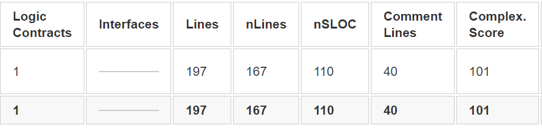
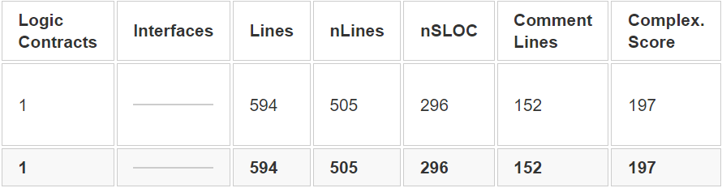
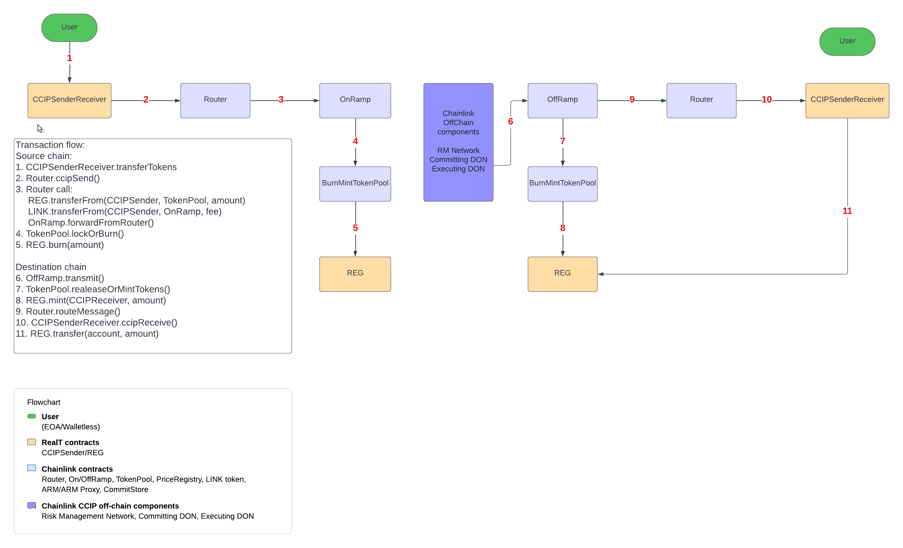

# Audit list

The list of contracts to be audited:

| Contracts                                                          | Description                                            | Need for audit |
| ------------------------------------------------------------------ | ------------------------------------------------------ | -------------- |
| [REG.sol](../contracts/reg/REG.sol)                                | RealToken Governance System ERC20 token                | Yes            |
| [CCIPSenderReceiver.sol](../contracts/ccip/CCIPSenderReceiver.sol) | Sender/Receiver contract for CCIP cross-chain transfer | Yes            |

Below are the list of dependencies used in these contracts. Since the interfaces and error libraries do not contain any logic, it might not be part of the audit.

## 1. REG imports

### From RealT

| Imports   | Description   | Need for audit                      |
| --------- | ------------- | ----------------------------------- |
| REGErrors | Error library | No (only contain error definitions) |
| IREG      | Interface     | No                                  |

### From Openzeppelin (audited)

| Imports                  | Description       | Need for audit |
| ------------------------ | ----------------- | -------------- |
| ERC20Upgradeable         | Abstract contract | No             |
| ERC20PausableUpgradeable | Abstract contract | No             |
| ERC20PermitUpgradeable   | Abstract contract | No             |
| SafeERC20Upgradeable     | Abstract contract | No             |
| Initializable            | Abstract contract | No             |
| UUPSUpgradeable          | Abstract contract | No             |
| AccessControlUpgradeable | Abstract contract | No             |

## 2. CCIPSenderReceiver imports

### From RealT

| Imports             | Description   | Need for audit                      |
| ------------------- | ------------- | ----------------------------------- |
| CCIPErrors          | Error library | No (only contain error definitions) |
| ICCIPSenderReceiver | Interface     | No                                  |
| IERC20WithPermit    | Interface     | No                                  |

### From Openzeppelin (audited)

| Imports                  | Description       | Need for audit |
| ------------------------ | ----------------- | -------------- |
| IERC20                   | Interface         | No             |
| SafeERC20                | Library           | No             |
| AddressUpgradeable       | Library           | No             |
| UUPSUpgradeable          | Abstract contract | No             |
| AccessControlUpgradeable | Abstract contract | No             |
| PausableUpgradeable      | Abstract contract | No             |

### From Chainlink (audited)

| Imports                 | Description | Need for audit |
| ----------------------- | ----------- | -------------- |
| Client                  | Library     | No             |
| IRouterClient           | Interface   | No             |
| IAny2EVMMessageReceiver | Interface   | No             |
| IERC165                 | Interface   | No             |

## 3. Audit Scope

- Commit Hash of reg-ccip-core contracts:
- In Scope:

| Contracts                                                          | Description          | nSLOC (estimated by Consensys plugin) |
| ------------------------------------------------------------------ | -------------------- | ------------------------------------- |
| [REG.sol](../contracts/reg/REG.sol)                                | ERC20                | 110                                   |
| [CCIPSenderReceiver.sol](../contracts/ccip/CCIPSenderReceiver.sol) | Cross-chain transfer | 292                                   |

Contracts metrics using solidity-metrics plugin (Consensys):

- REG

- CCIPSenderReceiver

## 4. Diagram

Below are diagrams of different components:

There is a contract CCIPSenderReceiver on each chain, which acts as entry point for user to initiate a cross-chain transfer or receive token from.

Users use the function transferTokens on the source chain to send token to the destination chain via CCIP

- User can user transferTokens in CCIPSenderReceiver contract to transfer REG cross-chain
- User pay CCIP fees in LINK, native or wrapped native
- Once the transfer is finished on the source chain, the TokenPool contract of Chainlink burns the token that need to be transferred
- Chainlink offchain components (Risk Management network, Committing DON, Executing DON) listen to the events on Chainlink contract EVM2EVMOnRamp.
- If everything is validated, it triggers a transaction on the destination chain to mint the token to CCIPSenderReceiver, then the CCIPSenderReceiver transfer the token to the receiver and emit an event for off-chain indexes.
