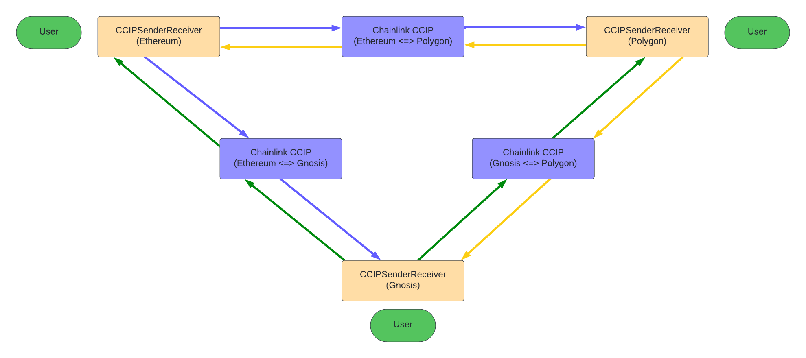
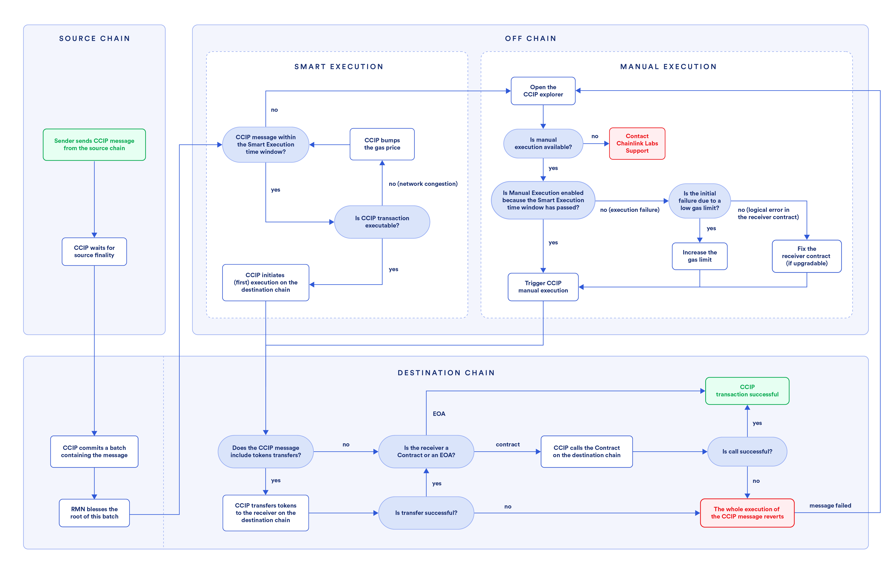

# User Guide for REG Token and CCIP Cross-Chain Functionality

Welcome to the user guide for the REG (RealToken Ecosystem Governance) Token and our cross-chain functionality using the CCIPSenderReceiver contract. This guide will help you understand how to interact with our tokens across different blockchain networks efficiently and securely.

## Overview of REG Token

REG is an ERC20 governance token designed to be used within the RealToken ecosystem. It leverages the robust OpenZeppelin contracts framework to ensure security and upgradeability.

### Key Features:

- ERC20Upgradeable: Allows for token upgrades without disrupting or losing the existing ledger.
- ERC20PausableUpgradeable: Provides functionality to pause token transfers in case of emergency.
- ERC20PermitUpgradeable: Enables gas-less transactions by allowing users to permit others to transfer tokens on their behalf.
- AccessControlUpgradeable: Manages roles and permissions, enhancing security and administrative capabilities.
- UUPSUpgradeable: Utilizes the UUPS (Universal Upgradeable Proxy Standard) pattern for secure contract upgrades.

### Token Management Functions:

Minting and Burning: Controlled by governance or through the CCIP Bridge for specific cross-chain actions.

- mintByGovernance/mintBatchByGovernance: Creates new tokens as governed.
- burnByGovernance: Destroys tokens held by the contract.
- mint (by Bridge): Mints tokens on the destination chain during a cross-chain transfer.
- burn (by Bridge): Burns tokens on the source chain during a cross-chain transfer.
- transferBatch: Enables transferring tokens to multiple addresses in one transaction, enhancing user convenience.

## CCIP Cross-Chain Functionality

Our cross-chain functionality is facilitated through the CCIPSenderReceiver contract, leveraging the Chainlink Cross-Chain Interoperability Protocol (CCIP). This system allows for secure and verified token transfers between different blockchain networks.

### How to Use the CCIPSenderReceiver Contract:

#### Transfer Tokens:

Use the transferTokens function to initiate a token transfer from the source chain to a destination chain. This function ensures that your tokens are burened on the source chain and subsequently minted on the destination chain.
Optionally, use transferTokensWithPermit to perform a transfer without requiring an initial approval transaction, saving gas and simplifying the process.

User can choose to pay CCIP fees in LINK, native (ETH, XDAI, MATIC) or wrapped native (WETH, WXDAI, WMATIC) of the source chain.

Please refer to [supported network](https://docs.chain.link/ccip/supported-networks/v1_2_0/mainnet)

#### Receive Tokens:

The ccipReceive function on the destination chain handles the receipt and final delivery of tokens that have been transferred. It verifies the transfer details and completes the token minting process to the designated receiver.

#### Administrative Functions:

- Allowlist Management: Admins can manage which chains and tokens are allowed for cross-chain transfers, ensuring compliance and security.
- Router Management: Set or update the address of the router responsible for handling cross-chain messages.
- Withdrawal Functions: Allows for the withdrawal of native or other tokens from the contract, providing flexibility in managing contract balances.

#### Diagrams and Flows

CCIPSenderReceiver Operations Across Chains:

- Diagram illustrating the flow of tokens between chains through our CCIP implementation, highlighting the sender and receiver contract roles on each network.

Transfer Process:

- Detailed flowchart showing the steps involved from initiating a token transfer on the source chain to receiving the tokens on the destination chain using CCIP.

If your token transfer isn't completed on the destination chain, possibly due to issues with gas limits or spikes in gas prices, you can manually complete the transaction. For guidance on how to perform this manual execution, please refer to the following instructions: [Chainlink CCIP Manual Execution](https://docs.chain.link/ccip/concepts/manual-execution).

